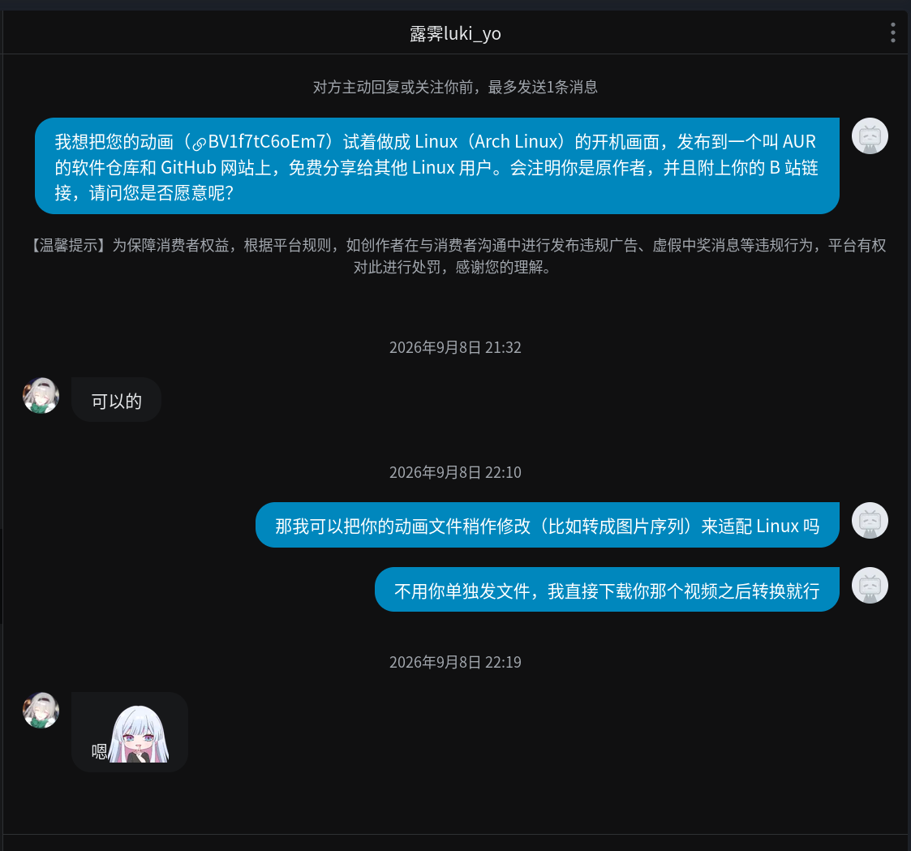

# HDD 开机动画 Plymouth 主题

把一段开机动画视频，做成 Arch Linux 的 Plymouth 开机画面。


- **背景**：PNG 帧序列动画（1280×720、20fps、181 帧）
- **上层**：启动日志浮层（半透明底 + 等宽字体，滚动显示 plymouth 推送的启动消息）
- **退出规则**：动画播完一轮才允许退出；按键 + 系统启动完成可立即退出
- **播完一轮后仍在启动流程中 → 保持最后一帧**（不循环）

仓库自带抽帧、安装/卸载、离线校验工具，换素材或换分辨率只需要跑一条命令。

> **开发方式**：本项目使用 **DSH（DeepSeek Harness）** 开发。
> **素材**：动画来自 B 站 UP 主 **露露luki_yo**，已获作者授权改编分享，见[素材来源与授权](#素材来源与授权)。
> **协议**：代码 MIT、素材非 MIT，见[开源协议](#开源协议)。

---

## 目录结构

```
hdd-plymouth-theme/
├── install.sh                        # 安装 / 卸载脚本
├── extract-frames.sh                 # mp4 → PNG 帧序列（自动同步 TOTAL_FRAMES）
├── LICENSE                           # MIT（仅代码）
├── src/                              # 源视频
│   ├── HDD开机动画1.mp4               # 9.07s  ← 主题用的这个
│   └── 拓展版HDD开机动画1.mp4          # 14.53s
├── theme/hdd-boot/                   # 主题本体
│   ├── hdd-boot.plymouth             # 主题配置
│   ├── hdd-boot.script               # 主题脚本（动画 + 日志 + 退出逻辑）
│   └── frames/                       # 帧序列 182 张（181 帧 + black.png）
├── optional/                         # 可选：systemd 延迟退出
│   ├── plymouth-quit-wait.conf
│   └── plymouth-quit-wait.sh
├── docs/
│   ├── preview.png                   # 上面那张预览图
│   └── source-authorization.png      # 原作者的授权聊天记录
└── ref/checker/                      # 离线校验工具
```

## 使用教程

### 第 1 步 · 拿到仓库

```bash
git clone https://github.com/fouc3-mirror/hdd-plymouth-theme.git
cd hdd-plymouth-theme
```

仓库里已经包含示例视频（`src/`）和转换好的帧序列（`theme/hdd-boot/frames/`），共约 200MB，
**可以直接安装**，不需要自己抽帧。想换成自己的视频见第 5 步。

### 第 2 步 · 确认系统前提

plymouth 需要满足两个条件才会显示图形启动画面：

1. **装了 plymouth**：`sudo pacman -S plymouth`
2. **`/etc/mkinitcpio.conf` 的 `HOOKS` 里要有 `plymouth`**，位置在 `udev` 之后、`block` / `encrypt` 之前：

   ```
   HOOKS=(base udev plymouth autodetect microcode modconf kms keyboard keymap consolefont block filesystems fsck)
   ```

3. **内核参数要有 `quiet splash`**：
   - GRUB：改 `/etc/default/grub` 的 `GRUB_CMDLINE_LINUX_DEFAULT`，加 `quiet splash`，然后 `sudo grub-mkconfig -o /boot/grub/grub.cfg`
   - systemd-boot：改 `/boot/loader/entries/*.conf` 的 `options` 行

改完 `HOOKS` 后重建 initramfs：`sudo mkinitcpio -P`。

> `install.sh` 会检测这两项并提示，但不会替你改系统配置。

### 第 3 步 · 安装

```bash
sudo ./install.sh --with-quit-wait
```

脚本依次做这些事：

1. 检查环境（plymouth、帧数与 `TOTAL_FRAMES` 是否一致、主题配置里的路径）
2. 复制主题到 `/usr/share/plymouth/themes/hdd-boot`
3. 记下当前默认主题（卸载时恢复用）
4. `plymouth-set-default-theme hdd-boot -R` —— 设为默认并重建 initramfs
   （会把主题目录含帧序列、以及日志浮层要用的字体一起打包，initramfs 会增大 ~86MB/内核）
5. 装 systemd 单元，让 `plymouth quit` 至少等动画播完一轮
6. 校验结果

其他用法：

| 命令 | 作用 |
|---|---|
| `sudo ./install.sh` | 不装 systemd 单元，只装主题 |
| `sudo ./install.sh --no-rebuild` | 只装主题，不重建 initramfs |
| `sudo ./install.sh --uninstall` | 卸载并恢复原默认主题 |
| `./install.sh --dry-run` | 只打印将做什么，不改系统（不用 sudo） |

### 第 4 步 · 重启看效果

```bash
sudo reboot
```

预期现象：GRUB 之后短暂黑屏 → 动画从第 1 帧播放约 9 秒 → 播完后停在最后一帧 →
左上角半透明日志条滚动显示启动消息 → 系统启动完成后 splash 退出，进入登录界面。

如果没看到动画，按[调试](#调试)那一节抓 `plymouthd` 日志。

### 第 5 步 · 换成自己的视频（可选）

```bash
cp /path/to/你的动画.mp4 src/
./extract-frames.sh src/你的动画.mp4 theme/hdd-boot/frames 20 1280x720
sudo ./install.sh --with-quit-wait      # 重新安装并重建 initramfs
```

抽帧脚本会把主题脚本里的 `TOTAL_FRAMES` 自动改成实际帧数，不用手改。

### 第 6 步 · 卸载

```bash
sudo ./install.sh --uninstall           # 恢复原默认主题 + 删除主题文件与 systemd 单元
```

想直接恢复系统默认主题（不改动本仓库）：`sudo plymouth-set-default-theme --reset -R`

## 换帧率 / 分辨率

```bash
./extract-frames.sh <输入mp4> <输出目录> <fps> <宽x高>
./extract-frames.sh src/HDD开机动画1.mp4 theme/hdd-boot/frames 15 960x540
```

帧序列在启动时会全部解码进内存（每像素 4 字节）。以 9.07s 的示例视频为例：

| 分辨率 | 帧率 | 帧数 | 磁盘 | 解码后内存 |
|---|---|---|---|---|
| 1280×720 | 20fps | 181 | ~86MB | ~670MB |
| 1280×720 | 15fps | 136 | ~65MB | ~500MB |
| 960×540 | 20fps | 181 | ~40MB | ~380MB |

视频越长帧数越多，体积按比例增长。机器内存小或 `/boot` 分区紧张时，用 960×540。

## 主题脚本

`theme/hdd-boot/hdd-boot.script` 顶部是配置区：`ANIM_FPS`、`TOTAL_FRAMES`、`SCALE_BG`、
`HOLD_LAST`、`LOG_VISIBLE`、`LOG_MAX_LINES`、`LOG_FONT`、`LOG_BAR_RATIO`。

脚本做的事：

| 功能 | 实现 |
|---|---|
| 背景动画 | 刷新回调里逐帧 `Scale()` 到窗口尺寸，设置给背景 sprite |
| 启动日志浮层 | `SetDisplayMessageFunction` / `SetUpdateStatusFunction` 收到消息 → 滚动缓冲 → `Image.Text()` 渲染成一张文字图 |
| 播完一轮 | 帧用完即置 `done`，停在最后一帧，不再推进 |
| 退出判定 | `done` 或（检测到按键 且 系统启动完成）→ `exit_allowed` |

## 可选：让 plymouth 至少等动画播完一轮

`plymouth-quit.service` 通常在启动收尾时才退出 splash，所以动画一般能播完。若某次启动比动画还快，
可以装这个单元，让 `plymouth quit` 等到动画播完一轮（默认 9.5s，可用环境变量 `PLYMOUTH_WAIT_SECONDS` 调整）：

```bash
sudo ./install.sh --with-quit-wait          # 装主题时一起装，推荐
```

它只推迟 `plymouth quit`，不影响系统启动本身：脚本按 plymouthd 的启动时间算出还差多久，只补足不足的部分。

## 调试

```bash
# 主题脚本能否被 plymouth 解析、逻辑是否正确（离线，不需要 root，也不需要装 plymouth）
./ref/checker/check theme/hdd-boot/hdd-boot.script
./ref/checker/run ref/checker/stub.script theme/hdd-boot/hdd-boot.script 2
#   场景: 1=未播完+quit  2=播完一轮  3=按键+启动完成  4=日志滚动

# 重新编译校验器（会自动 sparse clone plymouth 源码）
./ref/checker/build.sh

# 真机调试日志（含脚本语法错误、图片加载失败）
sudo plymouthd --debug --debug-file=/tmp/plymouth-debug.log --no-daemon --mode=boot
# 另一个终端：sudo plymouth show-splash / sudo plymouth quit
```

常见问题：

- **黑屏但能进系统**：多半是帧没打进 initramfs 或路径不对。`ls /usr/share/plymouth/themes/hdd-boot/frames | wc -l`
  应为 182（181 帧 + `black.png`）。
- **动画不动，只有一帧**：脚本有报错，看 debug log。
- **日志文字不显示**：initramfs 里字体没被识别。换个系统里 `fc-match` 能解析到的字体名写进
  `MonospaceFont` 和脚本的 `LOG_FONT`。

## 开源协议

| 范围 | 协议 |
|---|---|
| **代码**：主题脚本、`install.sh`、`extract-frames.sh`、`optional/`、`ref/checker/` | **MIT**，见 [`LICENSE`](LICENSE) |
| **素材**：`src/` 的源视频、`theme/hdd-boot/frames/` 的帧序列、`docs/` 里的图片 | **非 MIT**，版权归原作者 **露露luki_yo** 所有，见下节 |

素材不在 MIT 许可范围内。基于素材的再分发请**保留原作者署名并附上原视频链接**；
商业用途请自行联系原作者。

## 素材来源与授权

本仓库的主题素材（源视频及由其转换的帧序列）不是原创，来源与授权如下：

| 项 | 内容 |
|---|---|
| 原视频 | [《我把绝区零HDD开屏动画做进了Windows开机！》](https://www.bilibili.com/video/BV1f7tC6oEm7)（BV1f7tC6oEm7） |
| 原作者 | B 站 UP 主 **露露luki_yo** —— [个人空间](https://space.bilibili.com/3537104783018790) |

授权聊天记录（2026-09-08）：



据聊天记录，作者同意把该动画做成 Arch Linux 的开机画面并发布分享，也同意转成图片序列等修改，
条件是**注明原作者并附上原视频链接**。因此：

- 再分发时请保留本节署名与原视频链接，并自行确认授权范围。
- 游戏素材的相关权利归原权利方，本项目以非营利方式分享；如权利人提出异议会移除相关内容。
